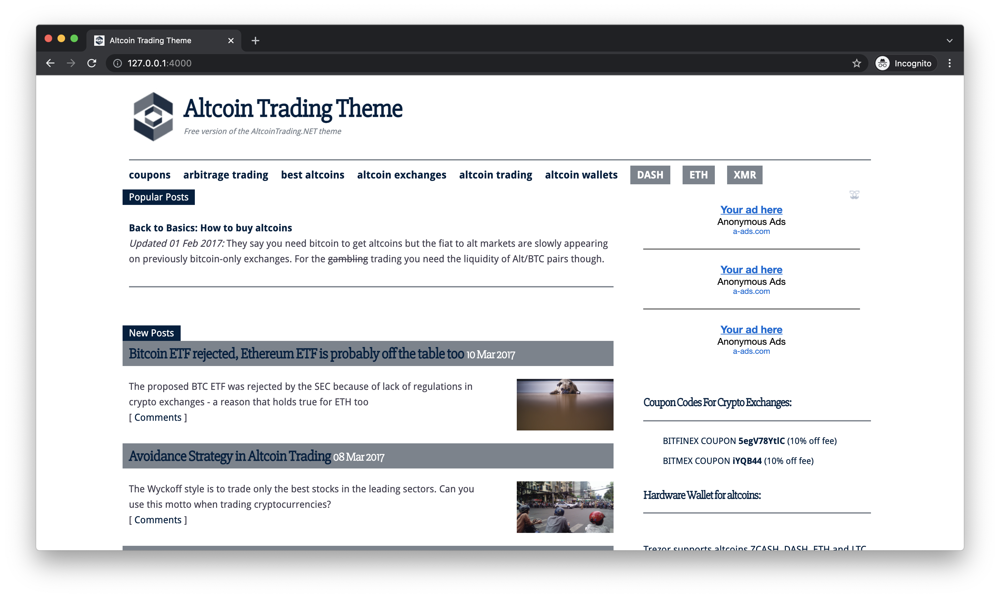

# "Trading": Free Jekyll Theme

Trading is a jekyll theme in newspaper style

This theme is AMP-ready (including Google Analytics and Disqus comments) and includes a basic version of JSON-LD markup for WebPage and Organisation.

## DEMO

https://trading.tdou.dev



This theme was developed in 2016 and is not maintained or updated in the free version.

This theme is open-source. It is an old template from [altcointrading.net](https://www.altcointrading.net) that is no longer in use. You may use this template for any kind of projects, including commercial ones.

[LICENSE (MIT)](LICENSE)

## Getting started

**In /website**

Configure your site in /website/_config.yml and install required gems.

```
cd website
bundle install
```

**In root**

You may use the shell scripts in the repository's root dir for faster serve, push or deploy.

```
./serve

./git.sh "commit message"

./deploy.sh "commit message" # configure your production server access

```

Alternatively you may use the standard jekyll commands from `/website`:

```
bundle exec jekyll serve
bundle exec jekyll build

```
